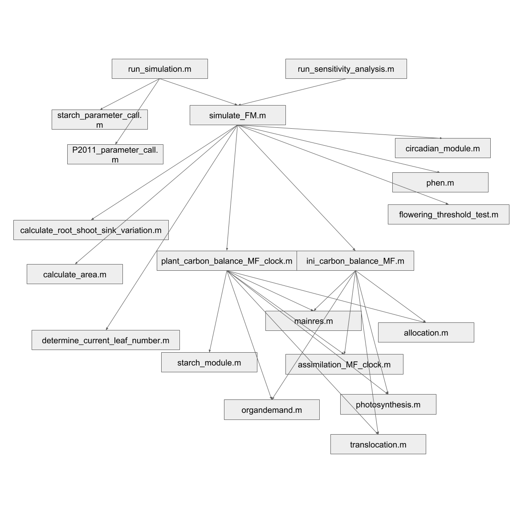

# frameworkmodel

This repository contains code to simulate the Arabidopsis Framework model v2, described in Chew et al, 2017 [https://doi.org/10.1101/105437].

The function "simulate_FM.m" runs the model.
It is called in the script "run_model_simulation", which also sets up model parameters.

The Web Application used the run_simulation.m version to run the model. This allows
period environment data to be used.

## Overview of module/function heirarchy

## License

This software is licensed under the Apache 2.0 license (see LICENSE.txt).
